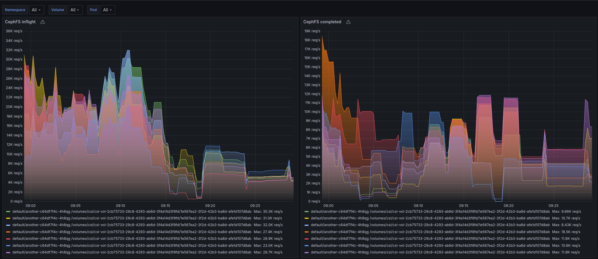

# CephFS I/O to OpenShift Workload/Pod metrics exporter 

The Ceph File System, or CephFS, is a POSIX-compliant file system built on top of Ceph’s distributed object store, RADOS. CephFS endeavors to provide a state-of-the-art, multi-use, highly available, and performant file store for a variety of applications, including traditional use-cases like shared home directories, HPC scratch space, and distributed workflow shared storage.

Unfortunately, there is no metric available to identify high dense OpenShift Workloads with CephFS I/O. 
This POC exporter creates the `missing link` between CephFS volumes and OpenShift Pods.

## Requirements

* podman 
* jq 
* ceph and daemon socket access
* kubernetes token to access PersistentVolume/v1 and Pod/v1 API

## Concept

The exporter connects to the MDS daemon socket and issues a `client ls` command which returns client and I/O (inflight,completed) metrics. A background task which periodically refreshes the list of configured CephFS PersistentVolumes and all Pods in the Cluster are extending those cephfs I/O metrics with OCP metadata to hint which workload creats Cluster wide impacting I/O.



## configure OpenShift for retrieving metadata

* create a namespace 
    ```
    oc create namespace cephfs-exporter
    ```
* create token for the serviceAccount you want to utilize (cephfs-exporter)
    ```
    oc -n cephfs-exporter create sa cephfs-exporter 
    TOKEN=$(oc -n cephfs-exporter create token cephfs-exporter --duration=864000m0s)
    ```
* create a kubeconfig file for your cephfs-exporter
    ```
    export API=$(oc whoami --show-server)
    cat <<'EOF' | envsubst > kubeconfig
    apiVersion: v1
    clusters:
    - cluster:
        server: ${API}
        insecure-skip-tls-verify: true
      name: default
    contexts:
    - context:
        cluster: default
        user: default
      name: default
    current-context: default
    kind: Config
    preferences: {}
    users:
    - name: default
      user:
        token: ${TOKEN}
    EOF
    ```
* create a ClusterRole for the cephfs-exporter
    ```
    cat <<'EOF'> clusterrole.yml
    apiVersion: rbac.authorization.k8s.io/v1
    kind: ClusterRole
    metadata:
      name: cephfs-exporter
      namespace: cephfs-exporter
    rules:
      - apiGroups:
          - ""
        resources:
          - pods
          - persistentvolumes
        verbs:
          - get
          - list
    EOF

    oc create -f clusterrole.yml
    ```
* create a RoleBinding for the cephfs-exporter
    ```
    cat <<'EOF'> clusterrolebinding.yml
    apiVersion: rbac.authorization.k8s.io/v1
    kind: ClusterRoleBinding
    metadata:
      name: cephfs-exporter
      namespace: cephfs-exporter
    roleRef:
      apiGroup: rbac.authorization.k8s.io
      kind: ClusterRole
      name: cephfs-exporter
    subjects:
      - kind: ServiceAccount
        name: cephfs-exporter
        namespace: cephfs-exporter
    EOF

    oc create -f clusterrolebinding.yml
    ```
* verify that your token has access to the require resources 
    ```
    KUBECONFIG=./kubeconfig oc get pods,persistentvolume -A -o jsonpath='{range .items[*]}{.kind}{" "}{.metadata.name}{"\n"}{end}'
    ```

## build the image yourself 

easiest way to build the cephfs-exporter is by using the included `Dockerfile` based on s2i. Off course you can change the base as long as you include all the dependencies and ensure, the daemon is started.

```
podman build -f Dockerfile -t localhost/cephfs-exporter:v1.1.0
```

## run the image on the MDS servers

The daemon needs to run on `each` MDS node as it requires access to the daemon socket. Further each instance also needs to have a copy of the kubernetes config file created in the steps above. 

```
export HOSTNAME=node1.example.com
export MDSID=mds.ocpfs
export DAEMONID=$(ceph orch ps --daemon_type mds --format json | jq -r '.[]|select(.service_name==env.MDSID)|select(.hostname==env.HOSTNAME)|.daemon_id')
export FSID=$(ceph fsid)
export IMAGE=quay.io/rhn_support_milang/cephfs-exporter:v1.1.0

podman rm -f cephfs-exporter
podman pull ${IMAGE}
podman run --name cephfs-exporter \
  -u 167 \
  -d \
  --rm \
  -p 8081:8080 \
  -v ./kubeconfig:/tmp/kubeconfig \
  -v /run/ceph/${FSID}/ceph-mds.${DAEMONID}.asok:/run/ceph/${FSID}/ceph-mds.${DAEMONID}.asok \
  -e ASOK=/run/ceph/${FSID}/ceph-mds.${DAEMONID}.asok \
  -e KUBECONFIG=/tmp/kubeconfig \
  ${IMAGE}
```
